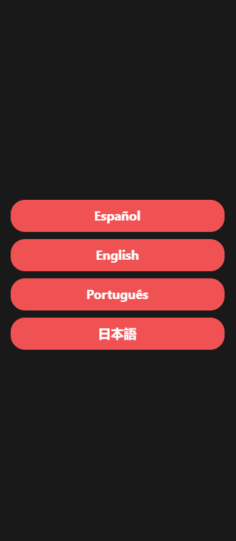
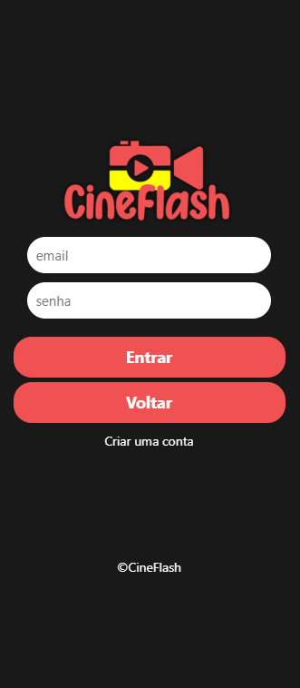
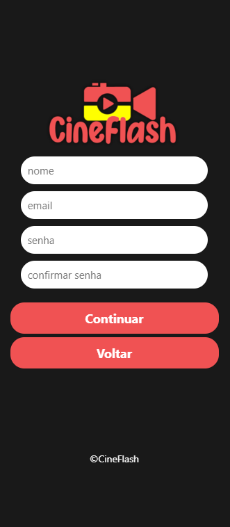
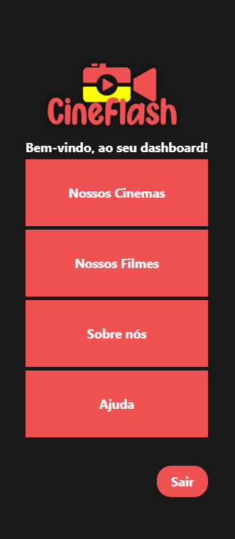
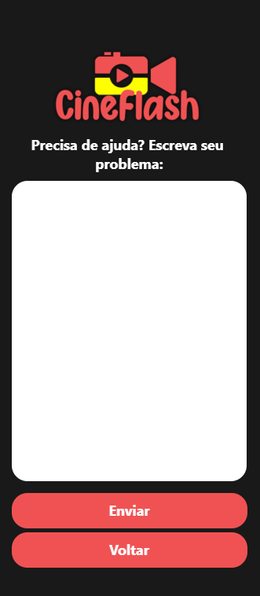

# Aplicativo Simples feito com React Native

Aplicativo de cinema com tradução, login, cadastro, dashboard sem back-end.

# Tela de configuração de idioma

  

# Tela de login

  

# Tela de cadastro

  

# Tela de dashboard

  

# Tela de ajuda

  

# Tela de sair

  

